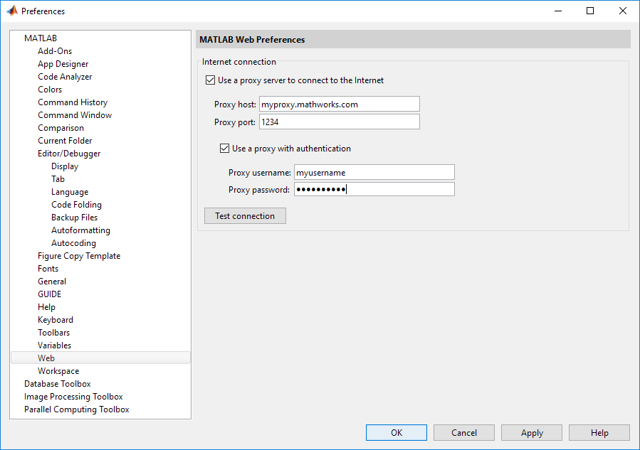

# Getting Started

Once this package is installed and authentication is in place one can begin working with SQS™ and looking at simple workflows. The [Basic Usage](BasicUsage.md) and [API Reference](SQSApidoc.md) documents provides greater details on the classes and methods being used along with information on error checking.

```
% Create the client called sqs
sqs = aws.sqs.Client();
% use a JSON credentials file
sqs.useCredentialsProviderChain = false;
sqs.initialize();

% create a Queue, note AWS provides naming guidelines
QueueName = 'com-example-myQueue';
createQueueResult = sqs.createQueue(QueueName);
queueUrl = createQueueResult.getQueueUrl();

% get a list of the Queues and see that com-example-myQueue appears
listQueueResult = sqs.listQueues();
urlList = listQueueResult.getQueueUrls();

% cleanup by deleting the Queue and shutting down the client
deleteQueueResult = sqs.deleteQueue(queueUrl);
sqs.shutdown;
```

## Logging
When getting started or debugging it can be helpful to get more feedback. Once the Client has been created one can set the logging level to verbose as follows:
```
logObj = Logger.getLogger();
logObj.DisplayLevel = 'verbose';
```
See: [Logging](Logging.md) for more details.


## Network proxy configuration

Many corporate networks require Internet access to take place via a proxy server. This includes the traffic between a MATLAB® session and Amazon's SQS servers.

Within the MATLAB environment one can specify the proxy settings using the web section of the preferences panel as shown:   
   
Here one can provide the server address and port as well as a username and password, if required.

In Windows one can also specify the proxy settings in Control Panel / Internet Options / Connections tab.

Other operating systems have similar network preference controls. Depending on one's network environment the proxy settings may also be configured automatically. However, by default the SQS Client will only use a proxy server once configured to do so. Furthermore a complex proxy environment may use different proxies for different traffic types and destinations.

One configures a proxy using the a ClientConfiguration object which is a property of the client. When the client is create if a proxy is configured in the MATLAB proxy configuration preferences then these values will be used and applied when the client is initialized. On Windows, were these not provided in the MATLAB preferences the Windows proxy settings would be used instead. Thus no intervention is required. However one can override the preferences and set proxy related values or reload values based on updated preferences. One can specify a specific proxy and port as follows. Note, this does not alter the settings in the MATLAB preferences panel.
```
sqs.clientConfiguration.setProxyHost('proxyHost','myproxy.example.com');
sqs.clientConfiguration.setProxyPort(8080);
```
The client is now configured to use the proxy settings given rather than those in the MATLAB preferences panel. In this case a username and password are not provided. They are normally not required for proxy access.

One can specify an automatic configuration URL as follows:
```
sqs.clientConfiguration.setProxyHost('autoURL','https://examplebucket.amazonaws.com');
sqs.clientConfiguration.setProxyPort('https://examplebucket.amazonaws.com');
```
This instructs the client to request a proxy port and host based on traffic to
https://examplebucket.amazonaws.com. Note, this is not the URL of the proxy itself. Different proxies may be in place to cover traffic to different addresses.

To use the username and password from the MATLAB preferences call:
```
sqs.clientConfiguration.setProxyUsername();
sqs.clientConfiguration.setProxyPassword();
```
Or to specify a username and password directly call:
```
sqs.clientConfiguration.setProxyUsername('JoeProxyUser');
sqs.clientConfiguration.setProxyPassword('2312sdsdes?$!%');
```

If a proxy server is being used, then the proxy values need to be configured as shown, this should be done with the client before initializing it for use.

------------

[//]: #  (Copyright 2018 The MathWorks, Inc.)
